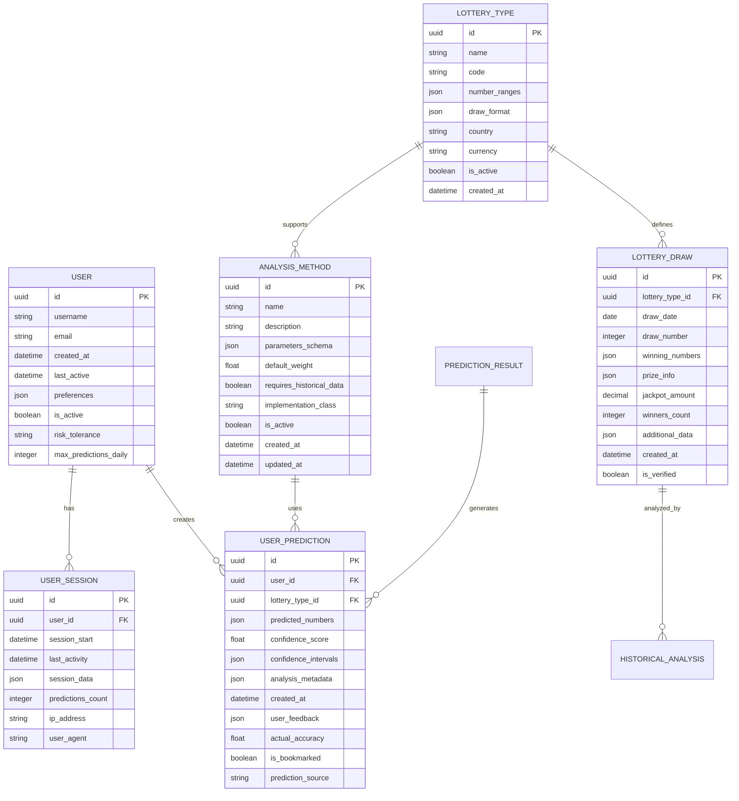

# Data Model: Lottery Prediction Website

**Created**: 2025-11-25
**Purpose**: Define data entities and relationships for the lottery prediction system

## Entity Relationship Overview



## Detailed Entity Definitions

### 1. User Management

#### User Entity
```python
class User(Base):
    __tablename__ = 'users'

    # Primary fields
    id = Column(UUID(as_uuid=True), primary_key=True, default=uuid.uuid4)
    username = Column(String(50), unique=True, nullable=False, index=True)
    email = Column(String(255), unique=True, nullable=False, index=True)
    password_hash = Column(String(255), nullable=False)

    # Timestamps
    created_at = Column(DateTime, default=datetime.utcnow)
    last_active = Column(DateTime, default=datetime.utcnow)

    # User preferences and settings
    preferences = Column(JSON, default={
        'preferred_analysis_methods': ['weighted_frequency'],
        'default_confidence_threshold': 0.7,
        'notifications_enabled': True,
        'theme': 'light'
    })

    # Behavioral settings
    risk_tolerance = Column(Enum('conservative', 'moderate', 'aggressive'), default='moderate')
    max_predictions_daily = Column(Integer, default=50)
    is_active = Column(Boolean, default=True)

    # Ethical compliance
    responsible_gambling_acknowledged = Column(Boolean, default=False)
    self_exclusion_until = Column(DateTime, nullable=True)
```

#### User Session Entity
```python
class UserSession(Base):
    __tablename__ = 'user_sessions'

    id = Column(UUID(as_uuid=True), primary_key=True, default=uuid.uuid4)
    user_id = Column(UUID(as_uuid=True), ForeignKey('users.id'), nullable=False)

    session_start = Column(DateTime, default=datetime.utcnow)
    last_activity = Column(DateTime, default=datetime.utcnow)

    # Session data for personalization
    session_data = Column(JSON, default={})
    predictions_count = Column(Integer, default=0)

    # Security and analytics
    ip_address = Column(String(45))  # IPv6 compatible
    user_agent = Column(Text)
```

### 2. Lottery Data Management

#### Lottery Type Entity
```python
class LotteryType(Base):
    __tablename__ = 'lottery_types'

    id = Column(UUID(as_uuid=True), primary_key=True, default=uuid.uuid4)
    name = Column(String(100), nullable=False)  # e.g., "大乐透"
    code = Column(String(20), unique=True, nullable=False)  # e.g., "SUPER_LOTTERY"

    # Number configuration
    number_ranges = Column(JSON, nullable=False, example={
        'main_numbers': {'min': 1, 'max': 35, 'count': 5},
        'bonus_numbers': {'min': 1, 'max': 12, 'count': 2}
    })

    # Draw format and rules
    draw_format = Column(JSON, nullable=False, example={
        'draw_frequency': 'weekly',
        'draw_days': ['tue', 'fri', 'sun'],
        'draw_time': '20:30',
        'timezone': 'Asia/Shanghai'
    })

    # Metadata
    country = Column(String(50), default='CN')
    currency = Column(String(3), default='CNY')
    is_active = Column(Boolean, default=True)
    created_at = Column(DateTime, default=datetime.utcnow)
```

#### Lottery Draw Entity
```python
class LotteryDraw(Base):
    __tablename__ = 'lottery_draws'

    id = Column(UUID(as_uuid=True), primary_key=True, default=uuid.uuid4)
    lottery_type_id = Column(UUID(as_uuid=True), ForeignKey('lottery_types.id'), nullable=False)

    # Draw identification
    draw_date = Column(Date, nullable=False)
    draw_number = Column(Integer, nullable=False)

    # Winning numbers (structured for different lottery types)
    winning_numbers = Column(JSON, nullable=False, example={
        'main_numbers': [1, 5, 12, 23, 31],
        'bonus_numbers': [3, 8]
    })

    # Prize information
    prize_info = Column(JSON, example={
        'tier_1': {'count': 1, 'amount': 10000000},
        'tier_2': {'count': 15, 'amount': 50000},
        'tier_3': {'count': 200, 'amount': 300}
    })

    jackpot_amount = Column(Numeric(15, 2))  # Up to 99 trillion
    winners_count = Column(JSON, example={
        'tier_1': 1,
        'tier_2': 15,
        'tier_3': 200
    })

    # Additional draw-specific data
    additional_data = Column(JSON, default={})
    created_at = Column(DateTime, default=datetime.utcnow)
    is_verified = Column(Boolean, default=True)

    # Performance indexes
    __table_args__ = (
        Index('idx_lottery_type_date', 'lottery_type_id', 'draw_date'),
        Index('idx_draw_number', 'draw_number'),
        UniqueConstraint('lottery_type_id', 'draw_number', name='uq_lottery_draw'),
    )
```

### 3. Prediction System

#### Analysis Method Entity
```python
class AnalysisMethod(Base):
    __tablename__ = 'analysis_methods'

    id = Column(UUID(as_uuid=True), primary_key=True, default=uuid.uuid4)
    name = Column(String(100), nullable=False)  # e.g., "Weighted Frequency Analysis"
    code = Column(String(50), unique=True, nullable=False)  # e.g., "WEIGHTED_FREQUENCY"

    description = Column(Text)
    parameters_schema = Column(JSON, example={
        'type': 'object',
        'properties': {
            'time_decay_factor': {'type': 'number', 'default': 0.95},
            'min_samples': {'type': 'integer', 'default': 50},
            'confidence_threshold': {'type': 'number', 'default': 0.7}
        }
    })

    # Configuration
    default_weight = Column(Float, default=1.0)
    requires_historical_data = Column(Boolean, default=True)
    implementation_class = Column(String(255), nullable=False)

    # Status
    is_active = Column(Boolean, default=True)
    created_at = Column(DateTime, default=datetime.utcnow)
    updated_at = Column(DateTime, default=datetime.utcnow, onupdate=datetime.utcnow)
```

#### User Prediction Entity
```python
class UserPrediction(Base):
    __tablename__ = 'user_predictions'

    id = Column(UUID(as_uuid=True), primary_key=True, default=uuid.uuid4)
    user_id = Column(UUID(as_uuid=True), ForeignKey('users.id'), nullable=False)
    lottery_type_id = Column(UUID(as_uuid=True), ForeignKey('lottery_types.id'), nullable=False)

    # Prediction results
    predicted_numbers = Column(JSON, nullable=False, example={
        'main_numbers': [3, 11, 17, 24, 33],
        'bonus_numbers': [2, 9]
    })

    confidence_score = Column(Float, nullable=False)  # 0.0 to 1.0
    confidence_intervals = Column(JSON, example={
        'main_numbers': [[1, 8], [9, 15], [16, 22], [23, 29], [30, 35]],
        'bonus_numbers': [[1, 6], [7, 12]]
    })

    # Analysis metadata
    analysis_metadata = Column(JSON, example={
        'methods_used': ['weighted_frequency', 'markov_chains'],
        'method_weights': {'weighted_frequency': 0.6, 'markov_chains': 0.4},
        'data_range': {'start_date': '2023-01-01', 'end_date': '2024-01-01'},
        'sample_size': 156,
        'statistical_significance': 0.73
    })

    # User interaction and feedback
    created_at = Column(DateTime, default=datetime.utcnow)
    user_feedback = Column(JSON, default={
        'rating': None,
        'comments': None,
        'helpfulness': None
    })

    actual_accuracy = Column(Float, nullable=True)  # Calculated after actual draw
    is_bookmarked = Column(Boolean, default=False)
    prediction_source = Column(Enum('web', 'api', 'batch'), default='web')

    # Ethical compliance
    responsible_gambling_shown = Column(Boolean, default=True)
    disclaimer_acknowledged = Column(Boolean, default=False)

    # Performance indexes
    __table_args__ = (
        Index('idx_user_created', 'user_id', 'created_at'),
        Index('idx_lottery_type_date', 'lottery_type_id', 'created_at'),
    )
```

### 4. Analytics and Monitoring

#### Historical Analysis Entity
```python
class HistoricalAnalysis(Base):
    __tablename__ = 'historical_analyses'

    id = Column(UUID(as_uuid=True), primary_key=True, default=uuid.uuid4)
    lottery_draw_id = Column(UUID(as_uuid=True), ForeignKey('lottery_draws.id'), nullable=False)

    # Analysis results
    hot_numbers = Column(JSON, example=[7, 14, 23, 31, 35])
    cold_numbers = Column(JSON, example=[2, 11, 19, 26, 34])
    frequency_distribution = Column(JSON)

    # Pattern analysis
    pattern_analysis = Column(JSON, example={
        'consecutive_numbers': {'count': 23, 'percentage': 14.7},
        'number_ranges': {'low': 45, 'medium': 62, 'high': 49},
        'odd_even_ratio': {'odd': 78, 'even': 78}
    })

    # Statistical metrics
    statistical_significance = Column(Float)
    confidence_level = Column(Float, default=0.95)

    created_at = Column(DateTime, default=datetime.utcnow)
    updated_at = Column(DateTime, default=datetime.utcnow, onupdate=datetime.utcnow)
```

## Data Validation Rules

### Input Validation

#### Lottery Numbers
```python
def validate_lottery_numbers(numbers: List[int], lottery_type: LotteryType) -> bool:
    """Validate lottery numbers against lottery type rules"""

    ranges = lottery_type.number_ranges
    main_numbers = numbers.get('main_numbers', [])
    bonus_numbers = numbers.get('bonus_numbers', [])

    # Check count
    if len(main_numbers) != ranges['main_numbers']['count']:
        return False
    if len(bonus_numbers) != ranges['bonus_numbers']['count']:
        return False

    # Check ranges
    main_min, main_max = ranges['main_numbers']['min'], ranges['main_numbers']['max']
    bonus_min, bonus_max = ranges['bonus_numbers']['min'], ranges['bonus_numbers']['max']

    if not all(main_min <= num <= main_max for num in main_numbers):
        return False
    if not all(bonus_min <= num <= bonus_max for num in bonus_numbers):
        return False

    # Check for duplicates
    if len(main_numbers) != len(set(main_numbers)):
        return False
    if len(bonus_numbers) != len(set(bonus_numbers)):
        return False

    return True
```

#### Prediction Confidence
```python
def validate_confidence_score(confidence: float) -> float:
    """Validate and cap confidence scores for ethical compliance"""

    # Constitutional requirement: Cap at 0.85
    max_confidence = 0.85

    if confidence > max_confidence:
        return max_confidence

    return max(0.0, min(confidence, 1.0))
```

### Business Logic Validation

#### Prediction Limits
```python
def check_user_prediction_limits(user: User) -> Dict:
    """Check if user has exceeded daily prediction limits"""

    today = datetime.utcnow().date()
    prediction_count = session.query(UserPrediction).filter(
        UserPrediction.user_id == user.id,
        func.date(UserPrediction.created_at) == today
    ).count()

    return {
        'allowed': prediction_count < user.max_predictions_daily,
        'current_count': prediction_count,
        'max_allowed': user.max_predictions_daily,
        'remaining': max(0, user.max_predictions_daily - prediction_count)
    }
```

## Data Migration Strategy

### Initial Data Population

#### Lottery Types
```sql
INSERT INTO lottery_types (id, name, code, number_ranges, draw_format, country, currency) VALUES
('super-lottery-uuid', '大乐透', 'SUPER_LOTTERY',
 '{"main_numbers": {"min": 1, "max": 35, "count": 5}, "bonus_numbers": {"min": 1, "max": 12, "count": 2}}',
 '{"draw_frequency": "weekly", "draw_days": ["tue", "fri"], "draw_time": "20:30", "timezone": "Asia/Shanghai"}',
 'CN', 'CNY');
```

#### Analysis Methods
```sql
INSERT INTO analysis_methods (id, name, code, description, implementation_class, default_weight) VALUES
('weighted-freq-uuid', 'Weighted Frequency Analysis', 'WEIGHTED_FREQUENCY',
 'Analyzes number frequency patterns with time-based weighting',
 'backend.src.ml.weighted_frequency.WeightedFrequencyModel', 1.0),
('markov-chains-uuid', 'Markov Chain Analysis', 'MARKOV_CHAINS',
 'Uses Markov chains to predict number transitions',
 'backend.src.ml.markov_chains.MarkovChainModel', 0.8),
('ensemble-methods-uuid', 'Ensemble Methods', 'ENSEMBLE',
 'Combines multiple prediction methods for improved accuracy',
 'backend.src.ml.ensemble_methods.EnsembleModel', 1.2);
```

### Data Retention Policy

#### User Data
- Predictions: Retain for 2 years, then anonymize
- Sessions: Retain for 30 days
- User accounts: Soft delete after 1 year of inactivity

#### Historical Data
- Lottery draws: Retain indefinitely (required for statistical analysis)
- Analysis results: Retain for 1 year, then regenerate as needed

## Privacy and Security Considerations

### Data Encryption
- Passwords: bcrypt with salt
- Personal data: AES-256 at rest
- API communication: TLS 1.3

### Data Anonymization
- Statistical analysis uses anonymized data
- User behavior analytics exclude personal identifiers
- Research data excludes direct identifiers

### Compliance
- GDPR compliance for EU users
- Data localization requirements for Chinese users
- Regular privacy impact assessments

## Performance Optimization

### Database Indexing Strategy
- Primary keys: UUID indexes
- Foreign keys: Standard indexes
- Query patterns: Composite indexes for common filters
- Time-series: Date-based partitioning

### Caching Strategy
- User sessions: Redis with TTL
- Prediction results: LRU cache based on input hash
- Historical data: Read replicas for analytical queries
- Static lookup data: Application-level caching

### Data Partitioning
- Historical lottery draws: Monthly partitions by date
- User predictions: Quarterly partitions by user_id
- Analytics data: Daily partitions for recent data, monthly for historical